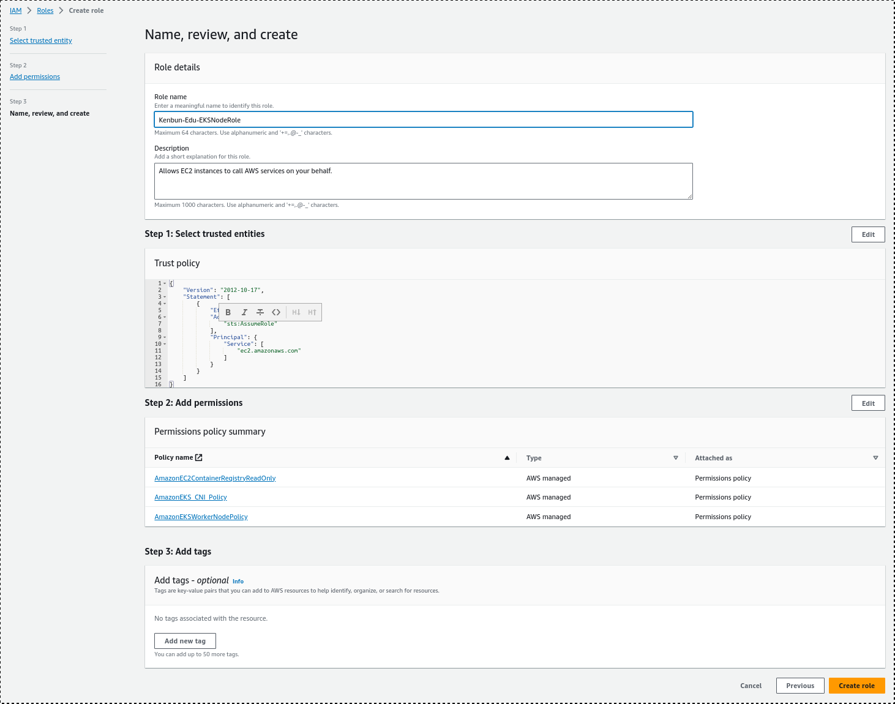
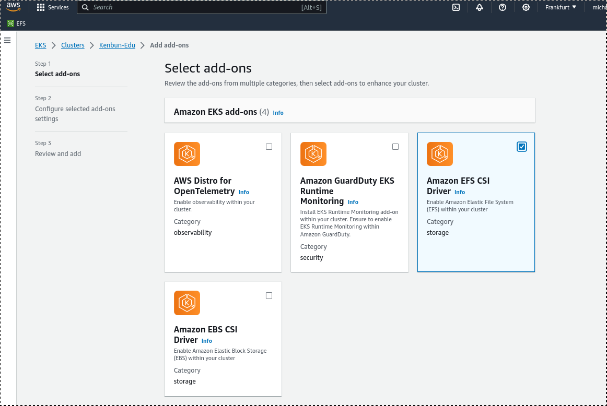

# Introduction
In this session we will create an EKS-kubernetes cluster on Amazon AWS with the following features:
- Multiple Zones in a AWS-Region with public and private subnets 
- Ability to create and provide PVC with AWS EFS persistant storage.
- Ability to create Ingress for services with AWS ALB-Controller in kubernetes

We will first create the cluster in the traditional way with the AWS Web Console and via aws-cli and eksctl. In the second session
we will use terrarform to create almost the same cluster and compare both approaches.  

# 2 Preparations
Install and configure the following:
- aws-cli, see https://docs.aws.amazon.com/cli/latest/userguide/getting-started-install.html
- eksctl, see https://eksctl.io/installation/
- kubctl, see https://kubernetes.io/docs/tasks/tools/

You should also be able to login to the AWS Management Console. The correct link should look like this: https://<aws-account-id>.signin.aws.amazon.com/console, alternatively: https://console.aws.amazon.com/ (here you have to enter your account-id). 

Please also make sure that you have the correct region you want to work with selected in the AWS-Console.


# 3 VPC
First we need to create a VPC that is than used by the EKS-Cluster that we will create. In Amazon terms, a VPC is a Virtual Network, not unlike a traditional physical Network. Especially for us, a VPC acts as a container for Subnets, Routing Tables and Security-Groups.

You can check the official documentation for creating a vpc here: https://docs.aws.amazon.com/eks/latest/userguide/creating-a-vpc.html

Navigate to the VPC section in the console and create a new VPC with the button on the top right.


Under "Resources create" activate "VPC and more". Leave the selection "Name tag auto-generation" on and enter a name, that will be used to auto-generate names for the entities that will be generated. I usually use the project name (also later for the cluster name). 
We can ignore ipv6 for now. Modify Availabilty Zones, public and private Subnets to your liking. In this session we leave the default settings. You don't need a S3 Gateway (unless you want one).


On the right side you see a preview of the Entities that will be created. 

The difference between public and private subnets is that host instances in private subnets have no direct connection to the internet, whereas host instances in public subnets have. So you can have more isolated hosts, which can be seen as a plus security wise - think database-servers who have no business communicating with the internet. 

After the subnets are created, revisit them and make sure that the public subnets have set the flag "Auto-assign public IPv4 address" to yes.


If not, use the menupoint "Edit subnet settings" under "Actions" to to check the flag "Enable autoassign public IPV4-Adresses"


# 4 EKS-Cluster

Now we will continue with creating the eks cluster. Head over to the EKS section of the aws console and view the cluster list.


We can create a new Cluster with the top right button. Before that we should make sure that we have a cluster service role. You can use an existing role you like to reuse. Usually i use a different Cluster Service Role for every cluster. Follow this link to learn
how to create a new Cluster Service Rule: https://docs.aws.amazon.com/eks/latest/userguide/service_IAM_role.html#create-service-role

#### Step 1


On step one choose a cluster-name (probably the same you used when creating the vpc). Select the latest kubernetes version and Select the Cluster Service Role you like to use.

#### Step 2


On step two choose the vpc you prepared before for the cluster. The public and private networks should be the ones you created along with the vpc.

You can leave the field Security Groups empty, a cluster-security group will be created for you.

Check the field Public and Private in "Cluster endpoint access".

#### Step 3


For now we leave CloudWatch Logs unconfigured.

#### Step 4


Here we just accept the 3 default add ons, nothing else. (Later we will add one additional add on for EFS.)

#### Step 5


Here we can select the exact versions of the add-ons to install. I usually select the Latest versions.

#### Step 6


Review your settings for the cluster and press the Create-Button.

### Update kube-config
aws eks update-kubeconfig --region region-code --name my-cluster
kubectl get svc
kubectl get nodes

### Add Node-Groups
Before we add Nodes to our cluster we need to have a node role. Check the following link on how to create one:
https://docs.aws.amazon.com/eks/latest/userguide/create-node-role.html
It should look like this:


After that we can create a new node group in the cluster on the compute-tab:
#### Step 1


#### Step 2


Select the Amazon Linux Ami, Capacity Purchase Option (I use On-Demand), an instance Type (t3.medium or t3.small) and 20 GiB of Disk Size.

Select desired, maximum and minimum size and maximum unavailable nodes to be tolerated.

#### Step 3


For this nodegroup select the public subnets, so that they have internet access. 

#### Step 4


Review your settings and press Create.


#5 EFS - IAM

First we have to create an IAM Role and attach a policy to it.

For that we need to make sure that our oicd provider is correctly configured, according to https://docs.aws.amazon.com/eks/latest/userguide/enable-iam-roles-for-service-accounts.html

Use this script to get the oidc-id after changing to your cluster-name:
```
cluster_name=Kenbun-Edu
oidc_id=$(aws eks describe-cluster --name $cluster_name --query "cluster.identity.oidc.issuer" --output text | cut -d '/' -f 5)
echo $oidc_id
```
It should output the oidc-id like this:

FD5FF0E8EDF14B41E5B12B98B0E351C5

We need this later on.

Check if this already in our account:
```
aws iam list-open-id-connect-providers | grep $oidc_id | cut -d "/" -f4
```
If this outputs nothing, we need to associate the oicd-provider with our cluster:
```
eksctl utils associate-iam-oidc-provider --cluster $cluster_name --approve
```

When this done, we can now follow this guide:
https://docs.aws.amazon.com/eks/latest/userguide/efs-csi.html
where we use the AWS-CLI approach:

We already did the first step, so the command
```
aws eks describe-cluster --name <ClusterName> --query "cluster.identity.oidc.issuer" --output text
```
should give you something like:
```
https://oidc.eks.eu-central-1.amazonaws.com/id/FD5FF0E8EDF14B41E5B12B98B0E351C5
```
With the same id as you seen above.

Now save the following in a file named "aws-efs-csi-driver-trust-policy.json"

```
{
  "Version": "2012-10-17",
  "Statement": [
    {
      "Effect": "Allow",
      "Principal": {
        "Federated": "arn:aws:iam::111122223333:oidc-provider/oidc.eks.region-code.amazonaws.com/id/EXAMPLED539D4633E53DE1B71EXAMPLE"
      },
      "Action": "sts:AssumeRoleWithWebIdentity",
      "Condition": {
        "StringLike": {
          "oidc.eks.region-code.amazonaws.com/id/EXAMPLED539D4633E53DE1B71EXAMPLE:sub": "system:serviceaccount:kube-system:efs-csi-*",
          "oidc.eks.region-code.amazonaws.com/id/EXAMPLED539D4633E53DE1B71EXAMPLE:aud": "sts.amazonaws.com"
        }
      }
    }
  ]
}
```
But make absolutely sure that you replace the string "region-code" with your region (3 times),
replace EXAMPLED539D4633E53DE1B71EXAMPLE with your oidc-id from before (also 3 times).
and replace 111122223333 with your AWS Account-ID.

Create the role with the command:
```
aws iam create-role \
--role-name <ClusterName>-EKS_EFS_CSI_DriverRole \
--assume-role-policy-document file://"aws-efs-csi-driver-trust-policy.json"
```
Take a note of the cluster-name in the role-name: Just to make clear that this role belongs to our cluster.

Now attach the AmazonEFSCSIDriverPolicy to that role with:
```
aws iam attach-role-policy \
  --policy-arn arn:aws:iam::aws:policy/service-role/AmazonEFSCSIDriverPolicy \
  --role-name <ClusterName>-EKS_EFS_CSI_DriverRole
```

After that we install the Amazon EFS-CSI-Driver-Addon:

In your new cluster in Amazon Elastic Kubernetes Service check the tab "Add-ons"


Press "Get more add-ons":


Check the box with "Amazon EFS CSI Driver" and press "Next" at the bottom of the page.


Select the latest version and very important: choose the role in "Select IAM Role" that you just created:


Now Review your settings and press "Create"


#6 EFS

Now we are ready to create a filesystem: navigate to efs:

and press "Create file system"

Give it a name (i usually prefix with the eks-cluster-name) and select the vpc you created at the start. Then, press NOT "Create", instead press "Customize".


Most settings on step 1 should be ok, you can customize as you wish. For testing purposes i usually disable automatic backups.

As VPC you leave the initally created vpc.

The subnet-ids are not that important, it should be one from every availability zone.

Change the Security groups to the one with your cluster-name in it.


Step 4 can be left as it is:


Review your settings in Step 5 and press "Create" at the bottom:


#6 EFS - Storageclass
Now we create a Kubernetes-storageclass for this filesystem. Take a note of the file system ID of the filesystem you just created.


Then create a file efs-sc.yaml with the following content:

```
kind: StorageClass
apiVersion: storage.k8s.io/v1
metadata:
  name: efs-sc
provisioner: efs.csi.aws.com
parameters:
  provisioningMode: efs-ap
  fileSystemId: <your filesystem-id>
  directoryPerms: "700"
  gidRangeStart: "1000"
  gidRangeEnd: "2000"
```
Make sure to replace <your filesystem-id> with the id of the filesystem you just created.

Apply this to kubernetes with the command:
```
kubectl apply -f efs-sc.yaml
```

With the command ``kubectl get sc``
you should see this output:
```
$ kubectl get sc
NAME            PROVISIONER             RECLAIMPOLICY   VOLUMEBINDINGMODE      ALLOWVOLUMEEXPANSION   AGE
efs-sc          efs.csi.aws.com         Delete          Immediate              false                  10m
gp2 (default)   kubernetes.io/aws-ebs   Delete          WaitForFirstConsumer   false                  3h49m
```

#7 EFS - Test
Now it is time to test the efs access with own pods and pvcs.

Store this pvc and pod definition in a file efs-pod.yaml

```
---
apiVersion: v1
kind: PersistentVolumeClaim
metadata:
  name: efs-claim-1
spec:
  accessModes:
    - ReadWriteMany
  storageClassName: efs-sc
  resources:
    requests:
      storage: 5Gi
---
apiVersion: v1
kind: Pod
metadata:
  name: efs-app-1
spec:
  containers:
    - name: app
      image: centos
      command: ["/bin/sh"]
      args: ["-c", "while true; do echo $(date -u) >> /data/out; sleep 5; done"]
      volumeMounts:
        - name: persistent-storage
          mountPath: /data
  volumes:
    - name: persistent-storage
      persistentVolumeClaim:
        claimName: efs-claim-1
```
The pod uses an efs-sc pvc and writes the current date every 5 seconds to the efs-filesystem.

Apply this file with ``kubectl apply -f `efs-pod.yaml`

After some time and if everything is correct the pvc should be in state bound and pod should be in state running:

```
$ kubectl get pvc
NAME          STATUS   VOLUME                                     CAPACITY   ACCESS MODES   STORAGECLASS   AGE
efs-claim-1   Bound    pvc-3b47351e-67c9-4d64-bc66-89f60af41d16   5Gi        RWX            efs-sc         19m
$ kubectl get pods
NAME        READY   STATUS    RESTARTS   AGE
efs-app-1   1/1     Running   0          14m
```
If it is not running after a while you can check the pod with ``kubectl describe pod efs-app-1`` and scan for error messages.

If it is running exec into the container and check the mounted file system:

```
$ kubectl exec -it efs-app-1 -- bash
[root@efs-app-1 /]# cd /data
[root@efs-app-1 data]# ls
out
[root@efs-app-1 data]# cat out
Thu Oct 12 01:37:29 UTC 2023
Thu Oct 12 01:37:34 UTC 2023
Thu Oct 12 01:37:39 UTC 2023
...
```
Even if you delete the pod and recreate it, the data will stay as long as you not delete the pvc.


#8 ALB - IAM
The AWS Load Balancer Controller provides both Ingress and a LoadBalancer type service. We need it to make services or websites visible to the internet.

To install it we use the guide at:
https://docs.aws.amazon.com/eks/latest/userguide/aws-load-balancer-controller.html

First we need to create a role for the ALB-Controller and attach a policy, not unlike what we did before with the EFS-CSI-Controller.

Unlike we seen for the efs-csi-controller, aws does not provide a managed policy, so we have to download the policy document first:
``
curl -O https://raw.githubusercontent.com/kubernetes-sigs/aws-load-balancer-controller/v2.5.4/docs/install/iam_policy.json
``

Create the policy with the following command:
```
aws iam create-policy \
--policy-name <Cluster-Name>-AWSLoadBalancerControllerIAMPolicy \
--policy-document file://iam_policy.json
```
Replace <Cluster-Name> with your cluster-name, so that this policy can be found easily. You can then look it up in the policies-section of the iam-dashboard:


After that we can create the role for the ALB-Controller: please note that we also use here to OIDC-ID from the section about the efs-controller-role above.

Create a file load-balancer-role-trust-policy.json with the following content:

```
cat >load-balancer-role-trust-policy.json <<EOF
{
    "Version": "2012-10-17",
    "Statement": [
        {
            "Effect": "Allow",
            "Principal": {
                "Federated": "arn:aws:iam::111122223333:oidc-provider/oidc.eks.region-code.amazonaws.com/id/EXAMPLED539D4633E53DE1B71EXAMPLE"
            },
            "Action": "sts:AssumeRoleWithWebIdentity",
            "Condition": {
                "StringEquals": {
                    "oidc.eks.region-code.amazonaws.com/id/EXAMPLED539D4633E53DE1B71EXAMPLE:aud": "sts.amazonaws.com",
                    "oidc.eks.region-code.amazonaws.com/id/EXAMPLED539D4633E53DE1B71EXAMPLE:sub": "system:serviceaccount:kube-system:aws-load-balancer-controller"
                }
            }
        }
    ]
}
EOF
```
Please make sure that again you replace the string "region-code" with your region (3 times),
replace EXAMPLED539D4633E53DE1B71EXAMPLE with your oidc-id from before (also 3 times).
and replace 111122223333 with your AWS Account-ID.

Then create the role with the command:
```
aws iam create-role \
  --role-name <Cluster-Name>-AmazonEKSLoadBalancerControllerRole \
  --assume-role-policy-document file://"load-balancer-role-trust-policy.json"
```

Attach the create policy to this role:
```
aws iam attach-role-policy \
  --policy-arn arn:aws:iam::111122223333:policy/<Cluster-Name>-AWSLoadBalancerControllerIAMPolicy \
  --role-name <cluster-name>AmazonEKSLoadBalancerControllerRole
```
Please note that i append the cluster-name before policy and role-name.

#9 ALB - Controller
Now we need to create the kubernetes service account for the alb-controller before we install it.

Create the file aws-load-balancer-controller-service-account.yaml:

```
cat >aws-load-balancer-controller-service-account.yaml <<EOF
apiVersion: v1
kind: ServiceAccount
metadata:
  labels:
    app.kubernetes.io/component: controller
    app.kubernetes.io/name: aws-load-balancer-controller
  name: aws-load-balancer-controller
  namespace: kube-system
  annotations:
    eks.amazonaws.com/role-arn: arn:aws:iam::111122223333:role/AmazonEKSLoadBalancerControllerRole
EOF
```
Change the role-arn to the arn of the created iam-role. You can look it up under roles in the iam-Section:


Apply the service account with the command:
```
kubectl apply -f aws-load-balancer-controller-service-account.yaml
```

Now we can install the alb-controller with a helm-chart:

```
$ helm repo add eks https://aws.github.io/eks-charts
$ helm repo update eks
$ helm install aws-load-balancer-controller eks/aws-load-balancer-controller \
  -n kube-system \
  --set clusterName=my-cluster \
  --set serviceAccount.create=false \
  --set serviceAccount.name=aws-load-balancer-controller 
```


#10 ALB - Test

#11 Whats missing
- https
- argocd
- elk-installation
- elk-anbindung
- grafana
- grafana-anbindung
