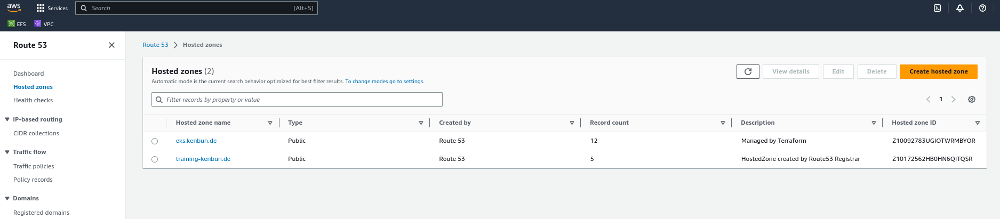
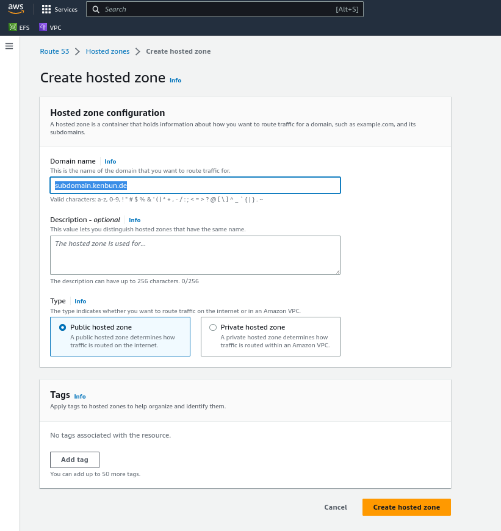
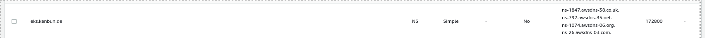

# Introduction
After we have seen how to create an eks-cluster the manual way, we create (almost) the same cluster with terraform.

Instead of using the Amazon AWS-Web-Console we can just describe the cluster in a script, apply it and everything gets magically setup.

We use for now terraform cloud, so now is a good time to read the introduction and make an account.

For directions use this manual: https://developer.hashicorp.com/terraform/tutorials/cloud-get-started/cloud-sign-up

We use the CLI-Driven workflow for this introduction.

# 2 Preparations
Install the terraform-cli according to https://developer.hashicorp.com/terraform/tutorials/aws-get-started/install-cli

Change to the terraform-directory of this repo (./2-eks-terraform/terraform) 
Modify the file variables.tf so, that it matches your aws region and your preferred subdomain. 

Install the IAM-AWS-Authenticator according to https://docs.aws.amazon.com/eks/latest/userguide/install-aws-iam-authenticator.html

Now check that you fullfill all prerequisites:

- Terraform v1.3+ installed locally.
- an AWS account
- the AWS CLI v2.7.0/v1.24.0 or newer, installed and configured
- AWS IAM Authenticator
- kubectl v1.24.0 or newer

# Prepare a DNS-Zone in Route 53
We want to use nice DNS Names for our services. For that we prepare an empty zone in Route 53. Go to route-53 and press 
"Create hosted zone"



This zone will be empty for now, it will later be filled by kubernetes-ingresses and by terraform with information about
the needed TLS-certificate.



Amazon will automatically create a NS-Record for your subdomain in this zone:



You have to connect this to the configuration of your main-domain. For example:

- Our main domain is "kenbun.de"
- We want to use "xxxx.eks.kenbun.de" as Domain-Names for the applications in the eks-cluster with the help of amazons route-53-zone we just created.
- To delegate this subdomain to route53 we create NS-Records with the aws-nameservers for the subdomain in your "normal" DNS - whereever that may be. Could be also route53 or a complete different provider. Example of our zonefile for "kenbun.de":
```
$ORIGIN kenbun.de.
$TTL 86400
; SOA Records
@		IN	SOA	hydrogen.ns.hetzner.com. dns.hetzner.com. 2023101700 86400 10800 3600000 3600
; NS Records
@		IN	NS	helium.ns.hetzner.de.
@		IN	NS	hydrogen.ns.hetzner.com.
@		IN	NS	oxygen.ns.hetzner.com.
eks		IN	NS	ns-1074.awsdns-06.org.
eks		IN	NS	ns-1847.awsdns-38.co.uk.
eks		IN	NS	ns-26.awsdns-03.com.
eks		IN	NS	ns-792.awsdns-35.net.
....
```

Here i added 4 NS-Records with the aws-name-servers for "eks" to the zonefile. So, every domain that ends with "eks.kenbun.de" will be resolved with the aws-nameservers.
This rather complex procedure is the reason why i can not leave the creation of the DNS-Zone to terraform.

A test with the dig-command looks like this:
```
~ dig NS eks.kenbun.de

; <<>> DiG 9.16.1-Ubuntu <<>> NS eks.kenbun.de
;; global options: +cmd
;; Got answer:
;; ->>HEADER<<- opcode: QUERY, status: NOERROR, id: 55546
;; flags: qr rd ra; QUERY: 1, ANSWER: 4, AUTHORITY: 0, ADDITIONAL: 1

;; OPT PSEUDOSECTION:
; EDNS: version: 0, flags:; udp: 65494
;; QUESTION SECTION:
;eks.kenbun.de.			IN	NS

;; ANSWER SECTION:
eks.kenbun.de.		39312	IN	NS	ns-1074.awsdns-06.org.
eks.kenbun.de.		39312	IN	NS	ns-1847.awsdns-38.co.uk.
eks.kenbun.de.		39312	IN	NS	ns-792.awsdns-35.net.
eks.kenbun.de.		39312	IN	NS	ns-26.awsdns-03.com.

;; Query time: 36 msec
;; SERVER: 127.0.0.53#53(127.0.0.53)
;; WHEN: Do Okt 19 05:17:38 CEST 2023
;; MSG SIZE  rcvd: 181
```

When you see a similar result then the delegation of the subdomain to AWS-Route 53 succeeded. A TLS-Certificate will be created by terraform, more Hostnames will later be added by kubernetes as more ingresses will be added.

You also need to configure your subdomain in the file variables.tf and in the file argocd-values.yaml - there argocd will be configured with the host-name "argocd.sub.domain.xx" - search for "eks.kenbun.de", there are 2 places that need to be changed.

# First terraform run

Execute ``terraform init`` in the terraform-directory which downloads a bunch of software and plugins.
```
~/2-eks-terraform/terraform$ terraform init

Initializing Terraform Cloud...
Initializing modules...

Initializing provider plugins...
- Finding hashicorp/tls versions matching ">= 3.0.0, ~> 4.0.4"...
- Finding hashicorp/cloudinit versions matching ">= 2.0.0, ~> 2.3.2"...
- Finding hashicorp/aws versions matching ">= 3.72.0, >= 4.42.0, >= 4.47.0, >= 4.57.0, >= 5.0.0, ~> 5.7.0"...
- Finding hashicorp/kubernetes versions matching ">= 2.10.0"...
- Finding latest version of hashicorp/helm...
- Finding hashicorp/time versions matching ">= 0.9.0"...
- Finding hashicorp/random versions matching "~> 3.5.1"...
- Installing hashicorp/cloudinit v2.3.2...
- Installed hashicorp/cloudinit v2.3.2 (signed by HashiCorp)
- Installing hashicorp/aws v5.7.0...
- Installed hashicorp/aws v5.7.0 (signed by HashiCorp)
- Installing hashicorp/kubernetes v2.23.0...
- Installed hashicorp/kubernetes v2.23.0 (signed by HashiCorp)
- Installing hashicorp/helm v2.11.0...
- Installed hashicorp/helm v2.11.0 (signed by HashiCorp)
- Installing hashicorp/time v0.9.1...
- Installed hashicorp/time v0.9.1 (signed by HashiCorp)
- Installing hashicorp/random v3.5.1...
- Installed hashicorp/random v3.5.1 (signed by HashiCorp)
- Installing hashicorp/tls v4.0.4...
- Installed hashicorp/tls v4.0.4 (signed by HashiCorp)

Terraform has created a lock file .terraform.lock.hcl to record the provider
selections it made above. Include this file in your version control repository
so that Terraform can guarantee to make the same selections by default when
you run "terraform init" in the future.

Terraform Cloud has been successfully initialized!

You may now begin working with Terraform Cloud. Try running "terraform plan" to
see any changes that are required for your infrastructure.

If you ever set or change modules or Terraform Settings, run "terraform init"
again to reinitialize your working directory.

```

Make sure that you have the following two environment variables defined:

- export AWS_ACCESS_KEY_ID = XXXXXXXXXX
- export AWS_SECRET_ACCESS_KEY = YYYYYYYYY

Now execute `terraform apply` in the terraform-directory and after some time a complete eks-cluster is available.

If everything works correctly, you will see this prompt where you can enter "yes":

```
  # module.eks.module.kms.aws_kms_key.this[0] will be created
  + resource "aws_kms_key" "this" {
      + arn                                = (known after apply)
      + bypass_policy_lockout_safety_check = false
      + customer_master_key_spec           = "SYMMETRIC_DEFAULT"
      + description                        = (known after apply)
      + enable_key_rotation                = true
      + id                                 = (known after apply)
      + is_enabled                         = true
      + key_id                             = (known after apply)
      + key_usage                          = "ENCRYPT_DECRYPT"
      + multi_region                       = false
      + policy                             = (known after apply)
      + tags_all                           = (known after apply)
    }

Plan: 79 to add, 0 to change, 0 to destroy.

Changes to Outputs:
  + cluster_endpoint          = (known after apply)
  + cluster_name              = (known after apply)
  + cluster_security_group_id = (known after apply)
  + identity-oidc             = (known after apply)
  + identity-oidc-id          = (known after apply)
  + identity-oidc-issuer      = (known after apply)
  + region                    = "eu-central-1"

Do you want to perform these actions in workspace "My-Workspace"?
  Terraform will perform the actions described above.
  Only 'yes' will be accepted to approve.

  Enter a value: yes

```


You can switch kubectl-config to the new cluster with:
```
aws eks --region $(terraform output -raw region) update-kubeconfig \
    --name $(terraform output -raw cluster_name)
```

After a while the cluster should be up and running.

# The terraform files

- terraform.tf Needed software versions - you normally don't need to touch this.
- variables.tf: settings like the aws-region
- outputs.tf: fields that will by outputted after every terraform apply. Yout can also access the values of the fields with the command ``terraform output -raw variablename``
- main.tf the main script that creates the cluster

# The main.tf file
You can easily compare the steps we configured in the manually session (eks-manual)

For example at the beginning:

```
module "vpc" {
  source = "terraform-aws-modules/vpc/aws"
  version = "5.0.0"

  name = "education-vpc"

  cidr = "10.0.0.0/16"
  azs = slice(data.aws_availability_zones.available.names, 0, 3)

  private_subnets = [
    "10.0.1.0/24",
    "10.0.2.0/24",
    "10.0.3.0/24"]
  public_subnets = [
    "10.0.4.0/24",
    "10.0.5.0/24",
    "10.0.6.0/24"]

  enable_nat_gateway = true
  single_nat_gateway = true
  enable_dns_hostnames = true
  map_public_ip_on_launch = true

  public_subnet_tags = {
    "kubernetes.io/cluster/${local.cluster_name}" = "shared"
    "kubernetes.io/role/elb" = 1
  }

  private_subnet_tags = {
    "kubernetes.io/cluster/${local.cluster_name}" = "shared"
    "kubernetes.io/role/internal-elb" = 1
  }
}
```
This creates the vpc. Difference is here, that we use 3 availability zones.

Then there is the eks-section:

```

module "eks" {
  source = "terraform-aws-modules/eks/aws"
  version = "19.15.3"

  cluster_name = local.cluster_name
  cluster_version = "1.28"

  vpc_id = module.vpc.vpc_id
  subnet_ids = module.vpc.private_subnets
  cluster_endpoint_public_access = true

  eks_managed_node_group_defaults = {
    ami_type = "AL2_x86_64"

  }

  eks_managed_node_groups = {
    one = {
      name = "node-group-1"
      subnet_ids = module.vpc.private_subnets

      instance_types = [
        "t3.small"]

      min_size = 1
      max_size = 3
      desired_size = 2
    }

    two = {
      name = "node-group-2"
      subnet_ids = module.vpc.public_subnets
      instance_types = [
        "t3.small"]

      min_size = 1
      max_size = 2
      desired_size = 1
    }
  }

  cluster_addons = {
    coredns = {
      most_recent = true
    }
    kube-proxy = {}
    vpc-cni = {
      most_recent = true
    }
  }
}
```
Here we create two nodegroups, one with private and one with public subnets.

After that we install the EFS Driver role / policy, after that we create the efs-filesystem.
Then we install the ALB-Controller including ALB-role and Policy.
Then we configure the Route 53-DNS-Zone for domain names and tls-certificates.
At the end we install argocd via helm-chart.

Beware: the first terraform apply may not succeed and fail with the installation of argocd. This will probably be because the AWS-Loadbalancer is not fully initialized. This is easy resolved with a second "terraform apply" after a couple of seconds. 

After some minutes you should be able to access argocd with the configured url (and the subdomain you specified), eg: https://argocd.sub.domain.xx

After a "terraform apply" - run a file "terraform.tfstate" will be created (or changed). This is the base for terraform to calculate diffs between the terraform config (mainly main.tf) and the last state of the aws-cluster. Subsequent runs of "terraform apply" will only create or change resources that have been changed since the last run.

You could add this file to a git-repo along with the config. It ist alternatively possible to upload this to a S3-Bucket or Azure-Bucket. 

I can give you a step by step walkthrough throug the process and technique if you are interested.
