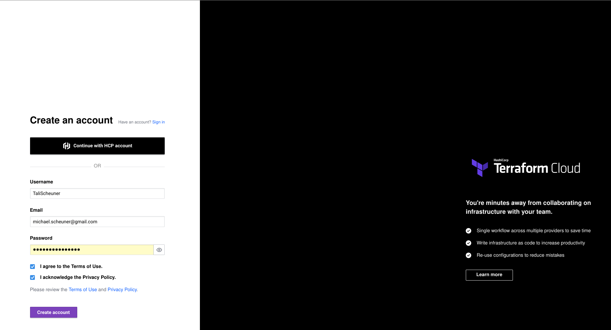
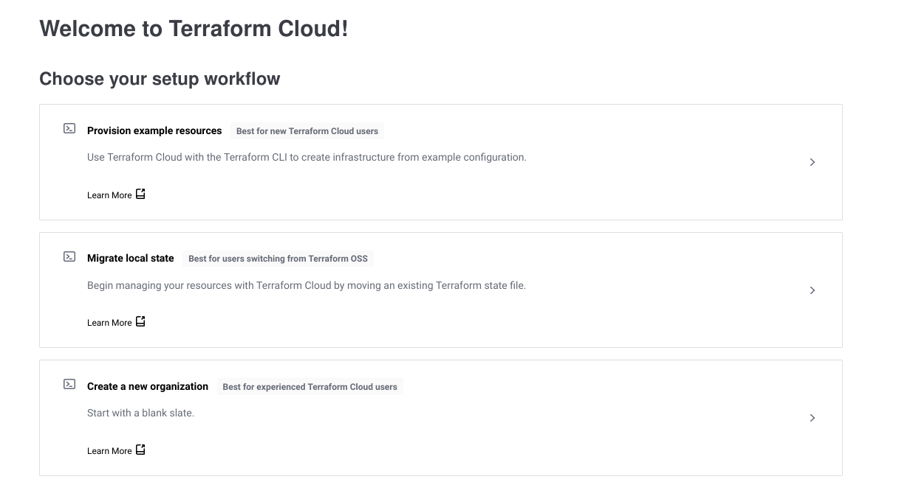
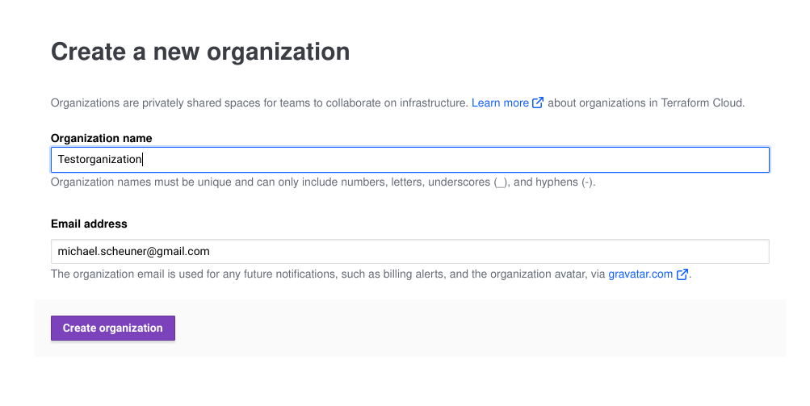
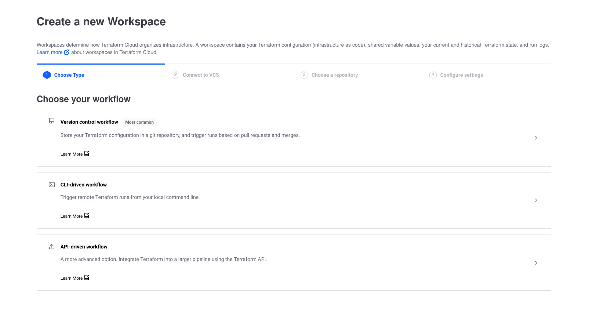
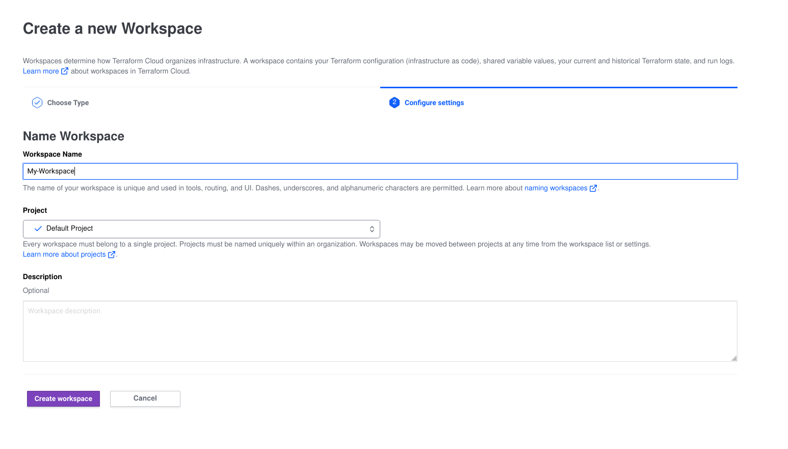
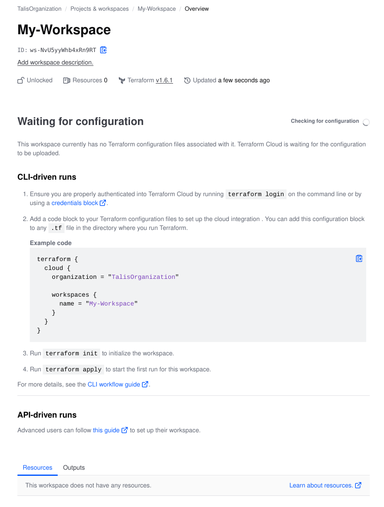
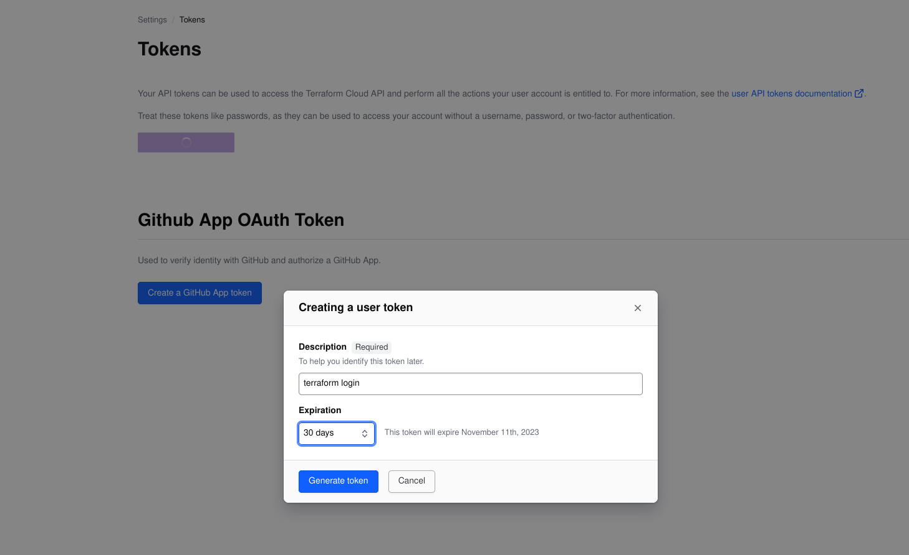
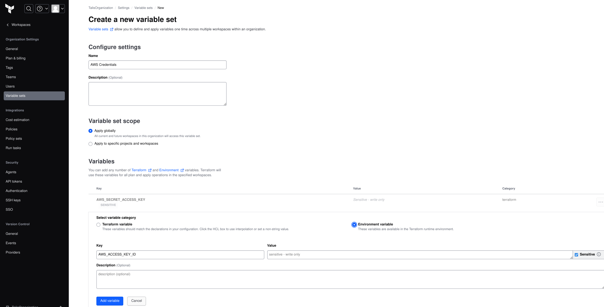
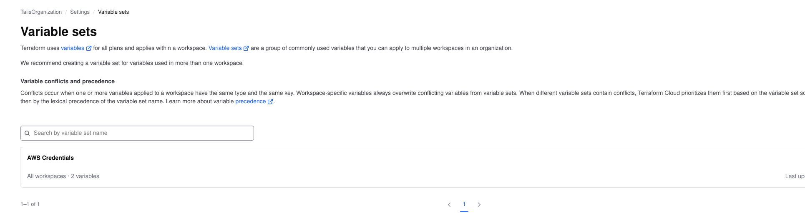

# Introduction
After we have seen how to create an eks-cluster the manual way, we create (almost) the same cluster with terraform.

Instead of using the Amazon AWS-Web-Console we can just describe the cluster in a script, apply it and everything gets magically setup.

We use for now terraform cloud, so now is a good time to read the introduction and make an account.

For directions use this manual: https://developer.hashicorp.com/terraform/tutorials/cloud-get-started/cloud-sign-up

We use the CLI-Driven workflow for this introduction.

# 2 Preparations
Make a terraform cloud account.



After using the confirmation link from the registration email, create a new organization.





After that create a new workspace.

Use the CLI-Driven Workflow.





Install the terraform-cli according to https://developer.hashicorp.com/terraform/tutorials/aws-get-started/install-cli

Login to terraform from the cli like here: https://developer.hashicorp.com/terraform/tutorials/cloud-get-started/cloud-login

```
$ terraform login
Terraform will request an API token for app.terraform.io using your browser.

If login is successful, Terraform will store the token in plain text in
the following file for use by subsequent commands:
    /home/michael/.terraform.d/credentials.tfrc.json

Do you want to proceed?
  Only 'yes' will be accepted to confirm.

  Enter a value: yes


---------------------------------------------------------------------------------

Terraform must now open a web browser to the tokens page for app.terraform.io.

If a browser does not open this automatically, open the following URL to proceed:
    https://app.terraform.io/app/settings/tokens?source=terraform-login


---------------------------------------------------------------------------------

Generate a token using your browser, and copy-paste it into this prompt.

Terraform will store the token in plain text in the following file
for use by subsequent commands:
    /home/michael/.terraform.d/credentials.tfrc.json

Token for app.terraform.io:
  Enter a value: Opening in existing browser session.

```
The browser now opens:



Generate the token and paste it into your console:

```


Retrieved token for user TaliScheuner


---------------------------------------------------------------------------------

                                          -                                
                                          -----                           -
                                          ---------                      --
                                          ---------  -                -----
                                           ---------  ------        -------
                                             -------  ---------  ----------
                                                ----  ---------- ----------
                                                  --  ---------- ----------
   Welcome to Terraform Cloud!                     -  ---------- -------
                                                      ---  ----- ---
   Documentation: terraform.io/docs/cloud             --------   -
                                                      ----------
                                                      ----------
                                                       ---------
                                                           -----
                                                               -


   New to TFC? Follow these steps to instantly apply an example configuration:

   $ git clone https://github.com/hashicorp/tfc-getting-started.git
   $ cd tfc-getting-started
   $ scripts/setup.sh

```


Change to the terraform-directory of this repo (./2-eks-terraform/terraform) 
Modify the file terraform.tf so, that it matches your organization and workspace 
and edit the file variables.tf that it matches your preferred aws-region.

Install the IAM-AWS-Authenticator according to https://docs.aws.amazon.com/eks/latest/userguide/install-aws-iam-authenticator.html

Set aws-credentials as terraform cloud variables according to here: https://developer.hashicorp.com/terraform/tutorials/cloud-get-started/cloud-create-variable-set


Make sure to set the Variable category for both to "Environment variable". Dont forget to press "create variable set" after you added both keys.


Now check that you fullfill all prerequisites:

- Terraform v1.3+ installed locally.
- a Terraform Cloud account and organization.
- Terraform Cloud locally authenticated.
- a Terraform Cloud variable set configured with your AWS credentials.
- an AWS account
- the AWS CLI v2.7.0/v1.24.0 or newer, installed and configured
- AWS IAM Authenticator
- kubectl v1.24.0 or newer

# First terraform run

Execute ``terraform init`` in the terraform-directory which downloads a bunch of software and plugins.
```
~/2-eks-terraform/terraform$ terraform init

Initializing Terraform Cloud...
Initializing modules...

Initializing provider plugins...
- Finding hashicorp/tls versions matching ">= 3.0.0, ~> 4.0.4"...
- Finding hashicorp/cloudinit versions matching ">= 2.0.0, ~> 2.3.2"...
- Finding hashicorp/aws versions matching ">= 3.72.0, >= 4.42.0, >= 4.47.0, >= 4.57.0, >= 5.0.0, ~> 5.7.0"...
- Finding hashicorp/kubernetes versions matching ">= 2.10.0"...
- Finding latest version of hashicorp/helm...
- Finding hashicorp/time versions matching ">= 0.9.0"...
- Finding hashicorp/random versions matching "~> 3.5.1"...
- Installing hashicorp/cloudinit v2.3.2...
- Installed hashicorp/cloudinit v2.3.2 (signed by HashiCorp)
- Installing hashicorp/aws v5.7.0...
- Installed hashicorp/aws v5.7.0 (signed by HashiCorp)
- Installing hashicorp/kubernetes v2.23.0...
- Installed hashicorp/kubernetes v2.23.0 (signed by HashiCorp)
- Installing hashicorp/helm v2.11.0...
- Installed hashicorp/helm v2.11.0 (signed by HashiCorp)
- Installing hashicorp/time v0.9.1...
- Installed hashicorp/time v0.9.1 (signed by HashiCorp)
- Installing hashicorp/random v3.5.1...
- Installed hashicorp/random v3.5.1 (signed by HashiCorp)
- Installing hashicorp/tls v4.0.4...
- Installed hashicorp/tls v4.0.4 (signed by HashiCorp)

Terraform has created a lock file .terraform.lock.hcl to record the provider
selections it made above. Include this file in your version control repository
so that Terraform can guarantee to make the same selections by default when
you run "terraform init" in the future.

Terraform Cloud has been successfully initialized!

You may now begin working with Terraform Cloud. Try running "terraform plan" to
see any changes that are required for your infrastructure.

If you ever set or change modules or Terraform Settings, run "terraform init"
again to reinitialize your working directory.

```
Now execute `terraform apply` in the terraform-directory and after some time a complete eks-cluster is available.

If everything works correctly, you will see this prompt where you can enter "yes":

```
  # module.eks.module.kms.aws_kms_key.this[0] will be created
  + resource "aws_kms_key" "this" {
      + arn                                = (known after apply)
      + bypass_policy_lockout_safety_check = false
      + customer_master_key_spec           = "SYMMETRIC_DEFAULT"
      + description                        = (known after apply)
      + enable_key_rotation                = true
      + id                                 = (known after apply)
      + is_enabled                         = true
      + key_id                             = (known after apply)
      + key_usage                          = "ENCRYPT_DECRYPT"
      + multi_region                       = false
      + policy                             = (known after apply)
      + tags_all                           = (known after apply)
    }

Plan: 79 to add, 0 to change, 0 to destroy.

Changes to Outputs:
  + cluster_endpoint          = (known after apply)
  + cluster_name              = (known after apply)
  + cluster_security_group_id = (known after apply)
  + identity-oidc             = (known after apply)
  + identity-oidc-id          = (known after apply)
  + identity-oidc-issuer      = (known after apply)
  + region                    = "eu-central-1"

Do you want to perform these actions in workspace "My-Workspace"?
  Terraform will perform the actions described above.
  Only 'yes' will be accepted to approve.

  Enter a value: yes

```

You can switch kubectl-config to the new cluster with:
```
aws eks --region $(terraform output -raw region) update-kubeconfig \
    --name $(terraform output -raw cluster_name)
```

After a while the cluster should be up and running.

# The terraform files

- terraform.tf global settings like organization and workspace. Also needed software versions.
- variables.tf: settings like the aws-region
- outputs.tf: fields that will by outputted after every terraform apply. Yout can also access the values of the fields with the command ``terraform output -raw variablename``
- main.tf the main script that creates the cluster

# The main.tf file
You can easily compare the steps we configured in the manually session (eks-manual)

For example at the beginning:

```
module "vpc" {
  source = "terraform-aws-modules/vpc/aws"
  version = "5.0.0"

  name = "education-vpc"

  cidr = "10.0.0.0/16"
  azs = slice(data.aws_availability_zones.available.names, 0, 3)

  private_subnets = [
    "10.0.1.0/24",
    "10.0.2.0/24",
    "10.0.3.0/24"]
  public_subnets = [
    "10.0.4.0/24",
    "10.0.5.0/24",
    "10.0.6.0/24"]

  enable_nat_gateway = true
  single_nat_gateway = true
  enable_dns_hostnames = true
  map_public_ip_on_launch = true

  public_subnet_tags = {
    "kubernetes.io/cluster/${local.cluster_name}" = "shared"
    "kubernetes.io/role/elb" = 1
  }

  private_subnet_tags = {
    "kubernetes.io/cluster/${local.cluster_name}" = "shared"
    "kubernetes.io/role/internal-elb" = 1
  }
}
```
This creates the vpc. Difference is here, that we use 3 availability zones.

Then there is the eks-section:

```

module "eks" {
  source = "terraform-aws-modules/eks/aws"
  version = "19.15.3"

  cluster_name = local.cluster_name
  cluster_version = "1.28"

  vpc_id = module.vpc.vpc_id
  subnet_ids = module.vpc.private_subnets
  cluster_endpoint_public_access = true

  eks_managed_node_group_defaults = {
    ami_type = "AL2_x86_64"

  }

  eks_managed_node_groups = {
    one = {
      name = "node-group-1"
      subnet_ids = module.vpc.private_subnets

      instance_types = [
        "t3.small"]

      min_size = 1
      max_size = 3
      desired_size = 2
    }

    two = {
      name = "node-group-2"
      subnet_ids = module.vpc.public_subnets
      instance_types = [
        "t3.small"]

      min_size = 1
      max_size = 2
      desired_size = 1
    }
  }

  cluster_addons = {
    coredns = {
      most_recent = true
    }
    kube-proxy = {}
    vpc-cni = {
      most_recent = true
    }
  }
}
```
Here we create two nodegroups, one with private and one with public subnets.

After that we install the EFS Driver role / policy, after that we create the efs-filesystem.
At the end, we install the ALB-Controller including ALB-role and Policy.

I can give you a step by step walkthroug if you are interested.
